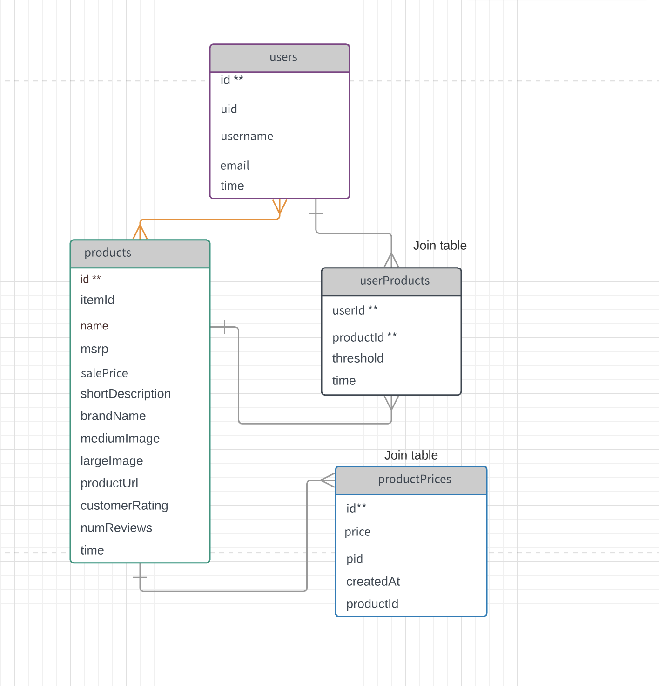

# Yecchy

A price tracking, analyzing and alerting web application that allows users set different price threshold for different products they want to track, visualize the trend and get notified if the retail price meets or drops that threshold value

# Tech Stack 

- Front-End - React, React Router, Chartjs
- Back-end - NodeJS, ExpressJS
- Authentication - Google Sign-In, Cookie
- Database - MySQL

# Schema 
 </img>

# Demo
<video width="1000" height="720" controls>
  <source src="files/yecchy_clip.mov">
</video>

